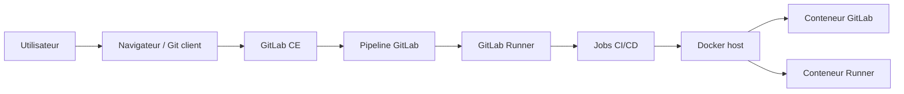
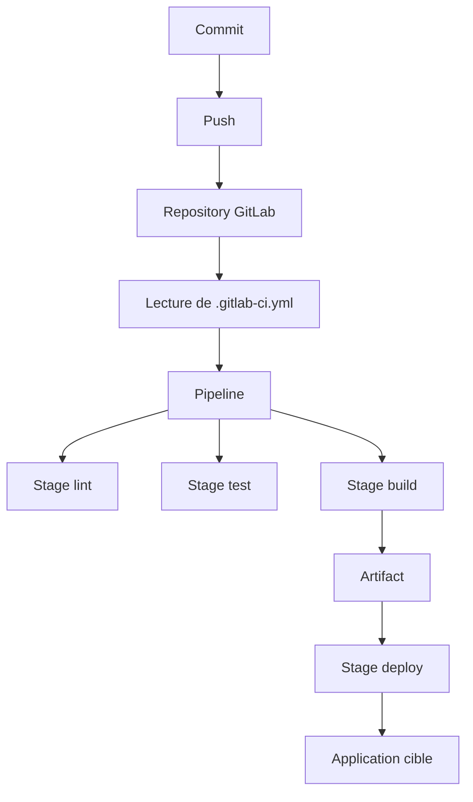

# Plan architectural du lab GitLab CI/CD

## Contexte

L'objectif de ce lab est pedagogique :

- apprendre GitLab
- comprendre l'orchestration CI/CD
- manipuler un runner local
- tester des pipelines sans infrastructure complexe

Le choix architectural privilegie :

- la simplicite
- la reproductibilite
- le faible cout
- une installation locale facile a reinitialiser

## Principes d'architecture

Le lab repose sur 2 conteneurs principaux :

- `gitlab`
- `gitlab-runner`

Les composants internes de GitLab tourent dans le conteneur `gitlab` :

- `nginx`
- `puma`
- `sidekiq`
- `postgresql`
- `redis`
- `gitaly`

## Schema global



## Vue logique

```text
+-------------------+
| Utilisateur       |
| Navigateur / Git  |
+---------+---------+
          |
          v
+-------------------+
| GitLab Web / SSH  |
| localhost:8080    |
| localhost:2224    |
+---------+---------+
          |
          v
+-------------------------------+
| Conteneur gitlab              |
|                               |
|  Nginx                        |
|    -> Puma / Rails            |
|    -> Sidekiq                 |
|    -> PostgreSQL              |
|    -> Redis                   |
|    -> Gitaly                  |
+---------+---------------------+
          |
          v
+-------------------------------+
| Conteneur gitlab-runner       |
|  Executor Docker              |
|  Lance les jobs CI            |
+-------------------------------+
```

## Vue fonctionnelle CI/CD



## Vue reseau

Ports exposes sur l'hote :

- `8080` vers le HTTP GitLab
- `8443` vers le HTTPS GitLab
- `2224` vers le SSH GitLab

Flux :

1. le navigateur appelle `http://localhost:8080`
2. Docker redirige vers `nginx` dans le conteneur GitLab
3. `nginx` transmet a `puma/rails`
4. Rails lit et ecrit dans PostgreSQL, Redis et Gitaly
5. les pipelines sont distribues au runner

Dans le cas d'un deploiement applicatif par CI/CD :

1. GitLab construit le pipeline
2. le runner recupere le job de deploy
3. le job pilote Docker sur l'hote cible
4. les conteneurs applicatifs sont demarres
5. un controle post-deploiement valide l'exposition de l'application

## Vue stockage

Volumes bind-mount utilises :

- `./data/gitlab/config:/etc/gitlab`
- `./data/gitlab/logs:/var/log/gitlab`
- `./data/gitlab/data:/var/opt/gitlab`
- `./data/runner/config:/etc/gitlab-runner`

Objectif :

- conserver la configuration
- conserver les journaux
- conserver l'etat GitLab entre deux redemarrages
- conserver la configuration du runner

## Choix techniques

### Pourquoi GitLab CE

- edition libre
- suffisante pour apprendre les fondamentaux CI/CD
- standard de marche tres repandu

### Pourquoi Docker Compose

- simple a lancer en local
- facile a lire
- bon support pedagogique

### Pourquoi un runner Docker

- execution isolee des jobs
- tres courant dans les exemples GitLab
- permet de reproduire des pipelines realistes

## Flux CI/CD cible

```text
Commit / Push
    |
    v
GitLab detecte .gitlab-ci.yml
    |
    v
Creation du pipeline
    |
    v
Attribution d'un job au runner
    |
    v
Runner lance un conteneur de job
    |
    v
Execution script / tests / build
    |
    v
Retour du statut dans GitLab
```

## Cas d'usage pedagogiques cibles

Le lab doit permettre de tester :

- pipeline mono-job
- pipeline multi-stages
- artifacts
- variables CI/CD
- regles `rules`
- branches et merge requests

## Contraintes

Contraintes connues :

- consommation memoire relativement lourde
- temps d'initialisation long au premier demarrage
- runner local avec acces au socket Docker de l'hote

Contraintes de securite :

- le montage `/var/run/docker.sock` donne des privileges eleves au runner
- le lab ne doit pas etre expose tel quel en public

## Evolution recommandee

### Niveau 1

Lab individuel local :

- GitLab CE
- 1 runner Docker
- projets de demo

### Niveau 2

Lab de validation plus complet :

- plusieurs runners
- projets applicatifs d'exemple
- pipelines `lint`, `test`, `build`, `package`

### Niveau 3

Lab de preproduction pedagogique :

- reverse proxy dedie
- TLS propre
- sauvegardes
- monitoring
- separation runner / GitLab sur des hotes distincts

## Decision log

Decisions prises :

- conserver une architecture minimale a 2 conteneurs
- utiliser les volumes locaux pour persister l'etat
- publier GitLab sur `localhost:8080`
- publier SSH Git sur `localhost:2224`
- garder une documentation orientee apprentissage plutot que production

## Recommandation finale

Cette architecture est bien adaptee pour :

- un poste individuel
- un TP
- un apprentissage progressif de GitLab CI/CD

Pour un usage au-dela du lab, il faudra separer clairement :

- la couche applicative GitLab
- la couche de base de donnees
- la couche runner
- la couche reseau et securite
