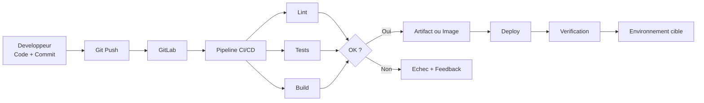
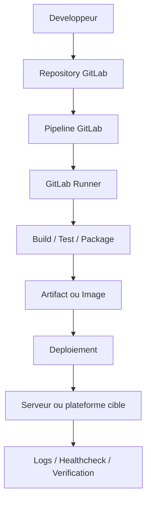

# Comprendre la CI/CD

Ce document explique la logique globale d'une chaine CI/CD, son role, son fonctionnement et la bonne facon de l'utiliser.

## Definition simple

`CI` signifie `Continuous Integration`.

L'idee :

- chaque changement de code est integre rapidement
- des verifications automatiques sont lancees
- les problemes sont detectes tot

`CD` signifie en pratique deux choses selon les equipes :

- `Continuous Delivery`
- `Continuous Deployment`

Difference :

- `Continuous Delivery` prepare un artefact deployable automatiquement, mais le declenchement final peut rester manuel
- `Continuous Deployment` pousse automatiquement jusqu'a l'environnement cible si toutes les conditions sont valides

## Pourquoi utiliser la CI/CD

Objectifs principaux :

- reduire les erreurs manuelles
- livrer plus souvent
- standardiser les controles qualite
- rendre les changements tracables
- accelerer le retour d'information

## Schema global

## Cycle type d'un pipeline

1. un developpeur pousse du code
2. GitLab lit `.gitlab-ci.yml`
3. GitLab construit un pipeline
4. les jobs sont distribues au runner
5. le runner execute les commandes dans des conteneurs
6. GitLab collecte les logs et les statuts
7. si les controles passent, un artefact ou un deploiement peut etre produit

## Roles des composants

### GitLab

GitLab orchestre :

- les depots Git
- les pipelines
- les variables CI/CD
- l'historique des executions
- les permissions

### Runner

Le runner execute les jobs.

Dans ce lab :

- il utilise Docker
- il lance un conteneur par job
- il peut aussi piloter Docker sur l'hote pour deployer une application

### `.gitlab-ci.yml`

C'est la definition declarative du pipeline.

On y decrit :

- les `stages`
- les jobs
- les images utilisees
- les scripts
- les `artifacts`
- les `rules`
- les environnements

## Que met-on dans la CI

Exemples typiques :

- verification de syntaxe
- lint
- tests unitaires
- tests d'integration
- build d'image Docker
- publication d'artefacts

## Que met-on dans la CD

Exemples typiques :

- deploiement en environnement de developpement
- deploiement en recette
- deploiement en preproduction
- deploiement en production
- smoke tests apres deploiement

## Bon pipeline vs mauvais pipeline

Un bon pipeline :

- est rapide
- est lisible
- donne un resultat fiable
- est versionne avec le code
- separe clairement validation, build et deploy

Un mauvais pipeline :

- est monolithique
- est lent sans raison
- embarque des secrets dans le YAML
- ne differencie pas les environnements
- deploie sans verification

## Architecture logique d'une CI/CD

## Comment bien l'utiliser

La bonne approche consiste a penser la CI/CD comme une chaine de confiance.

Questions a se poser :

- qu'est-ce que je veux verifier avant de livrer ?
- quel artefact est considere comme deployable ?
- sur quels environnements je deploie ?
- qui peut deployer et dans quelles conditions ?
- comment je valide qu'un deploiement a reussi ?

## Progression recommandee

Ordre de maturite conseille :

1. pipeline minimal
2. lint et tests
3. build d'artefact
4. deploiement en environnement de lab
5. smoke test post-deploiement
6. deploiement conditionnel et manuel
7. strategie de rollback

## Ce qu'il faut retenir

- la CI/CD n'est pas seulement un script automatique
- c'est une maniere fiable de transformer du code en livraison exploitable
- la valeur vient autant des controles que du deploiement lui-meme
