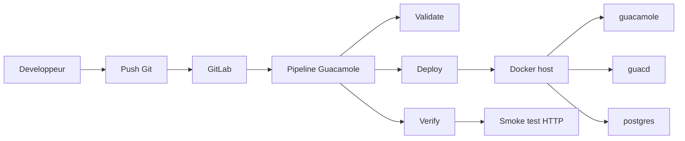

# Cas complet : deploiement de Guacamole par CI/CD

Ce document montre un cas complet et pedagogique de deploiement d'une application via GitLab CI/CD.

Application choisie :

- Apache Guacamole

Pourquoi ce choix :

- application web utile pour une demo
- architecture multi-conteneurs simple a comprendre
- deploiement Docker officiel documente

## Objectif

Montrer une chaine complete :

1. definition de la stack applicative
2. definition du pipeline GitLab
3. validation de la configuration
4. deploiement via runner
5. verification post-deploiement

## Architecture du cas Guacamole

## Composants deployes

La stack contient :

- `guacamole`
- `guacd`
- `postgres`

Le schema suit la documentation officielle Guacamole :

- separation du client web
- separation de `guacd`
- base PostgreSQL dediee

## Ports retenus pour le lab

GitLab occupe deja `8080`.

Le lab Guacamole utilise donc :

- `8081` pour l'interface Guacamole

## Structure d'exemple

Le cas complet est disponible dans :

- [examples/guacamole/README.md](/root/GitLab/examples/guacamole/README.md)
- [examples/guacamole/.gitlab-ci.yml](/root/GitLab/examples/guacamole/.gitlab-ci.yml)
- [examples/guacamole/docker-compose.guacamole.yml](/root/GitLab/examples/guacamole/docker-compose.guacamole.yml)
- [examples/guacamole/.env.example](/root/GitLab/examples/guacamole/.env.example)

## Fonctionnement du pipeline

### Stage `validate`

But :

- verifier que la stack Docker Compose est valide

Exemples de controles :

- syntaxe du YAML
- expansion des variables
- coherence generale de la stack

### Stage `deploy`

But :

- deployer les conteneurs sur l'hote Docker cible

Dans ce lab :

- le runner utilise le socket Docker de l'hote
- il pilote Docker directement

### Stage `verify`

But :

- verifier que l'application est joignable apres deploiement

Exemple :

- requete HTTP sur la page de login

## Variables CI/CD recommandees

Dans GitLab, creer au minimum :

- `GUACAMOLE_DB_PASSWORD`

Variables optionnelles utiles :

- `GUACAMOLE_HTTP_PORT`
- `GUACAMOLE_DB_NAME`
- `GUACAMOLE_DB_USER`

Bonne pratique :

- masquer les secrets
- proteger les variables utilisees pour des branches sensibles

## Utilisation recommandee

Sequence pedagogique :

1. creer un projet GitLab dedie a Guacamole
2. copier l'exemple Guacamole dans ce projet
3. enregistrer le runner
4. definir les variables CI/CD
5. lancer `validate`
6. lancer `deploy`
7. lancer `verify`
8. ouvrir Guacamole dans le navigateur

## Premiere connexion Guacamole

Une fois la base initialisee, l'utilisateur d'administration cree par les scripts SQL est :

- `guacadmin`

Mot de passe initial :

- `guacadmin`

Action recommandee :

- changer ce mot de passe immediatement

## Ce que cet exemple vous apprend

- comment GitLab lit un pipeline
- comment un runner execute des jobs
- comment un pipeline peut piloter Docker
- comment distinguer validation, deploy et verification
- comment utiliser la CI/CD pour autre chose qu'un simple `echo`

## Limites du lab

Ce cas est adapte a un apprentissage local.

Il n'est pas concu tel quel pour :

- la production
- l'exposition publique
- le multi-environnement industriel

Pour aller plus loin, il faudrait ajouter :

- reverse proxy
- TLS
- sauvegardes
- supervision
- separation des hotes GitLab et applicatifs

## References officielles

L'exemple de ce depot suit la logique de la documentation officielle Apache Guacamole :

- installation Docker avec `guacamole`, `guacd` et une base separee
- utilisation de PostgreSQL
- initialisation de la base via les scripts fournis

References :

- https://guacamole.apache.org/doc/gug/guacamole-docker.html
- https://guacamole.apache.org/doc/gug/postgresql-auth.html
